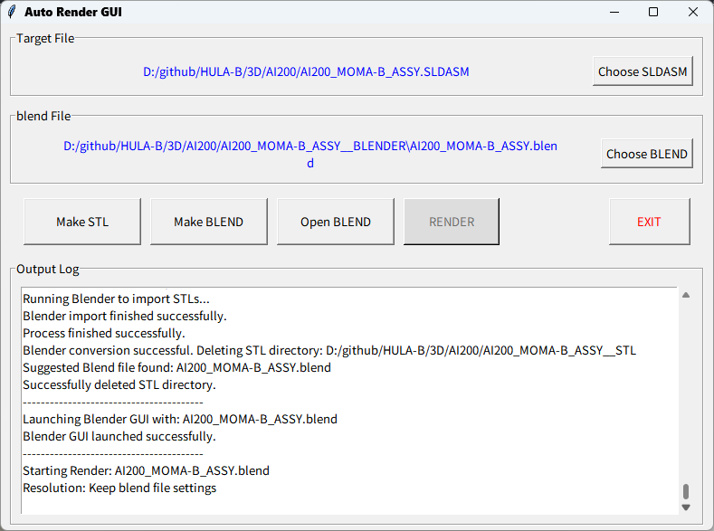
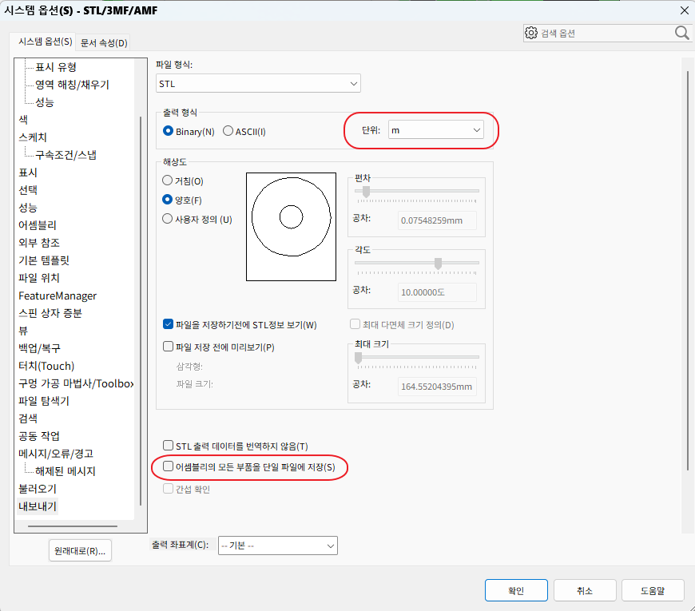

# Auto Render Tool (자동 렌더링 도구)

이 프로그램은 SolidWorks 어셈블리 파일(`*.SLDASM`)을 Blender 씬으로 자동 변환하고, 최적의 조감도 뷰포트에서 고품질 제품 이미지를 자동으로 렌더링해주는 도구입니다.

부품의 이름 키워드(예: Screw, Bolt, Bearing, Housing 등)에 따라 적절한 재질(Brushed Nickel, Stainless Steel, Copper, Aluminium, Pearl Black Plastic 등)을 자동으로 매핑해주며, 최적의 3점 조명과 4방향 Isometric 카메라를 자동으로 배치해줍니다.

특히 모든 GUI와 팝업은 윈도우 **시스템 기본 폰트**를 적용하여 선명하고 또렷하게 표시되며, 고해상도(DPI) 배율을 완벽히 지원합니다.




---

## ✨ 핵심 기능 요약

* **4방향 Isometric 카메라 지원**: 피사체를 비스듬히 내려다보는 4가지 조감도 방향의 카메라(`Camera_ISO_FR`, `Camera_ISO_FL`, `Camera_ISO_BR`, `Camera_ISO_BL`)를 자동 배치하여 완벽한 다각도 뷰를 얻을 수 있습니다.
* **이름 기반 스마트 재질 매핑**: 하드코딩된 색상 정보 대신 부품명을 기반으로 질감과 반사율이 가미된 정밀한 스튜디오 금속/플라스틱 재질을 자동 부여합니다.
* **프로 스튜디오 조명**: 피사체의 크기에 알맞은 광량(Energy)과 크기를 가진 3점 Area 조명(Key, Fill, Rim)을 카메라 앵글에 맞춰 자동 생성합니다.
* **Cycles GPU 고품질 렌더링 및 디노이즈**: Cycles 렌더 엔진 및 GPU 연산을 활용하며, 뷰포트 최대 64 샘플 및 렌더 최대 512 샘플링과 디노이즈(Denoise)를 기본 적용해 깨끗하고 부드러운 고품질 이미지를 빠르게 얻을 수 있습니다.
* **백색광 환경 및 배경 투명화 (RGBA)**: 월드 환경 조명(World Background)을 백색광으로 채워 피사체에 밝고 화사한 톤을 제공하면서도, 최종 렌더링 필름은 투명하게 처리(RGBA)하여 배경이 없는 고품질 제품 이미지를 즉시 추출할 수 있습니다.


---

## 🛠️ 사전 요구 사항 (Prerequisites)

이 도구를 실행하기 위해 다음 프로그램들이 Windows 환경에 설치되어 있어야 합니다.

1. **SolidWorks**: 어셈블리 파일을 열고 STL을 내보내기 위해 설치되어 있어야 합니다.
2. **Blender (5.0 이상 권장)**: 3D 씬 구성 및 렌더링을 위해 필요합니다.
   * 이 폴더의 **`blender_exe.txt`** 파일에 Blender 실행 파일(`blender.exe`)의 전체 경로를 반드시 기입해야 합니다.
3. **uv**: 빠르고 효율적인 Python 패키지 실행 관리자입니다.
   * `uv`가 내부 스크립트 실행 환경을 자동으로 관리해 줍니다.

> [!TIP]
> **추천 설치 방법 (Scoop 이용 시):**
> ```bash
> scoop install uv blender
> ```
> 이후 설치된 `blender.exe`의 실제 경로를 이 폴더의 `blender_exe.txt` 파일에 입력하세요. (예: `C:\Users\Username\scoop\apps\blender\current\blender.exe`)

* Solidworks 셋팅은 아래 이미지 참조




---

## 🚀 사용 방법

**`AUTO_RENDER_GUI.bat`**를 사용하여 마우스 클릭만으로 [SolidWorks ➡️ STL ➡️ Blender ➡️ 렌더링] 전체 단계를 제어할 수 있습니다.


#### **Step 1: 프로그램 실행**
* `AUTO_RENDER_GUI.bat` 파일을 더블 클릭하여 통합 GUI 창을 띄웁니다.

#### **Step 2: SolidWorks 파일 선택**
* **`Choose SLDASM`** 버튼을 클릭하여 변환하고자 하는 SolidWorks 어셈블리 파일(`.SLDASM`)을 선택합니다.
* *선택한 어셈블리에 여러 설정(Configuration)이 존재하는 경우, 설정 선택 팝업창이 나타나며 원하는 구성을 편리하게 고를 수 있습니다.*

#### **Step 3: STL 부품 파일 추출 (`Make STL`)**
* **`Make STL`** 버튼을 누르면 솔리드웍스가 실행되어 개별 부품 단위의 STL 파일들을 내보냅니다.
* > [!IMPORTANT]
  > **억제 부품 자동 필터링**: 현재 선택된 설정(Configuration)에서 **억제된(Suppressed) 부품들은 자동으로 감지되어 추출에서 제외**되며, 오직 활성화된 부품들만 내보냅니다. 원본 파일은 수정 없이 안전하게 닫힙니다.
* 완료 시 어셈블리 파일과 동일한 경로에 `[어셈블리명]__STL` 폴더가 생성됩니다.

#### **Step 4: 블렌더 씬 구성 및 재질 매핑 (`Make BLEND`)**
* **`Make BLEND`** 버튼을 누릅니다. 추출된 STL 파일들을 모아 자동으로 3D 씬을 재구성합니다.
* > [!TIP]
  > **스마트 이름 기반 재질 매핑**: 부품 파일명에 포함된 단어를 스캔하여 가장 적절한 금속 및 플라스틱 재질을 자동 매핑합니다.
  > * `screw`, `bolt`, `pin`, `washer` 등 🔩 ➡️ **Brushed Nickel** (브러시드 니켈)
  > * `bearing` ⚙️ ➡️ **Stainless Steel** (스테인리스 스틸)
  > * `stator` + `coil` ➡️ **Copper** (구리 코일)
  > * `housing`, `case`, `cover` 등 외관 부품 ➡️ **Pearl Black Plastic** (펄 블랙 플라스틱)
  > * 기타 일반 부품 ➡️ **Aluminium** (알루미늄)
* 4방향 Isometric 카메라와 3점 스튜디오 조명이 자동으로 배치되며, 완료 시 `[어셈블리명]__BLENDER` 폴더 내에 `[어셈블리명].blend` 파일이 생성됩니다.
* *(변환이 성공하면 임시로 생성되었던 `__STL` 폴더는 공간 확보를 위해 자동으로 안전하게 삭제됩니다.)*

#### **Step 5: 씬 최종 확인 및 편집 (선택 사항 - `Open BLEND`)**
* **`Open BLEND`** 버튼을 클릭하면, 현재 구성된 `.blend` 파일의 디자인을 수동으로 편집할 수 있도록 독립된 Blender GUI 창이 비동기로 실행됩니다. 
* 레이아웃을 확인하거나 카메라/조명 위치 등을 직접 미세 조정하고 저장한 뒤 창을 닫으시면 됩니다.

#### **Step 6: 자동 배치 렌더링 (`RENDER`)**
* **`RENDER`** 버튼을 클릭하고 생성된 `.blend` 파일을 선택합니다.
* 백그라운드(헤드리스)에서 블렌더의 고품질 **Cycles GPU 렌더러**가 실행되어, 미리 세팅된 4가지 Isometric 카메라 각도에서 고품질 제품 이미지를 자동으로 차례대로 렌더링합니다.
* 결과물은 `.blend` 파일이 있는 `__BLENDER` 폴더 내에 투명 배경(`RGBA PNG`) 형태로 저장됩니다.

#### **Step 7: 종료 (`EXIT`)**
* **`EXIT`** 버튼을 눌러 GUI를 닫고 전체 작업을 종료합니다.

