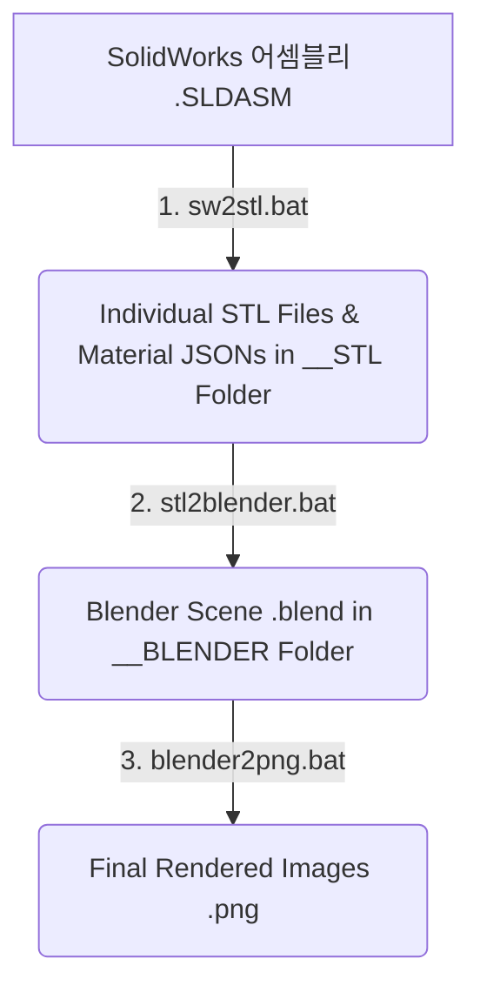

# Auto Render Tool (자동 렌더링 도구)

이 프로그램은 SolidWorks 어셈블리 파일(`*.SLDASM`)을 Blender 씬으로 자동 변환하고, 최적화된 조감도 뷰포트에서 고품질 이미지를 자동으로 렌더링해주는 도구입니다.

솔리드웍스에서 설정해 둔 부품 고유의 색상 정보(RGB, 투명도, 거칠기 등)를 블렌더의 Principled BSDF 재질로 자동 맵핑하며, 최적의 3점 조명과 4방향 Isometric 카메라를 자동으로 배치해줍니다.


---

## 🚀 전체 워크플로우 개요

본 도구는 크게 **3단계 변환 과정**을 거치며, 이를 개별적으로 수행할 수 있는 독립 배치 파일(`.bat`)들과 일괄 처리할 수 있는 통합 배치 파일들을 제공합니다.



---

## 🛠️ 사전 요구 사항 (Prerequisites)

이 도구를 실행하기 위해 다음 프로그램들이 Windows 환경에 설치되어 있어야 합니다.

1. **SolidWorks**: 어셈블리 파일을 열고 STL을 내보내기 위해 설치되어 있어야 합니다.
2. **Blender (5.0 이상)**: 3D 씬 구성 및 렌더링을 위해 필요합니다.
   * `blender_exe.txt` 파일에 Blender 실행 파일(`blender.exe`)의 전체 경로를 올바르게 기입해야 합니다.
3. **uv**: 빠르고 효율적인 Python 패키지 실행 관리자입니다.
   * Python이나 라이브러리를 직접 설치할 필요 없이 `uv`가 내부 스크립트 실행을 자동 처리합니다.

> [!TIP]
> **추천 설치 방법 (Scoop.sh 이용 시):**
> ```bash
> scoop install uv blender
> ```
> 이후 설치된 `blender.exe`의 실제 경로를 이 폴더의 `blender_exe.txt` 파일에 입력하세요. (예: `C:\Users\Username\scoop\apps\blender\current\blender.exe`)

---

## 📂 실행 배치(.bat) 파일 사용 방법 및 순서

### Method 1. 단계별 순차 실행 (개별 세부 제어)
특정 변환 단계만 따로 실행하거나 단계별 중간 결과물을 검토하고 싶을 때 사용하는 독립 실행 방식입니다. 아래 순서대로 사용해 주세요.

#### **1단계: `sw2stl.bat` (SolidWorks ➡️ STL & 재질 정보 추출)**
* **역할**: SolidWorks 어셈블리 파일을 열고, 개별 부품 단위의 STL 파일과 각 부품의 색상/재질 정보를 담은 `.json` 파일로 변환합니다.
* **사용법**: 
  1. `.SLDASM` 파일을 **`sw2stl.bat`** 아이콘 위에 **드래그 앤 드롭(Drag & Drop)**합니다.
  2. 또는 명령 프롬프트(CLI)에서 실행합니다:
     ```cmd
     sw2stl.bat [어셈블리_파일_경로.SLDASM]
     ```
* **결과물**: 원본 어셈블리 파일과 같은 경로에 **`[파일명]__STL`** 폴더가 생성되며, 그 안에 각 부품의 STL 파일과 재질 메타데이터 JSON 파일들이 저장됩니다.

#### **2단계: `stl2blender.bat` (STL ➡️ Blender 씬 생성)**
* **역할**: 1단계에서 추출된 `__STL` 폴더를 읽어 Blender 씬을 자동 구성합니다.
* **주요 자동 설정**:
  * 부품별 STL 파일 자동 임포트 및 원점 중심 정렬
  * 표면 Smooth 처리 (`shade_smooth_by_angle` 적용)
  * JSON 메타데이터 기반 스마트 재질(Base Color, Roughness, Specular, Transmission, Emission) 자동 적용
  * **4방향 조감도 Isometric 카메라 자동 배치** (Front-Right, Front-Left, Back-Right, Back-Left)
  * 3점 조명 스튜디오 세팅 (Key, Fill, Rim Light) 자동 설치
* **사용법**:
  1. 1단계의 결과물인 **`[파일명]__STL`** 폴더를 **`stl2blender.bat`** 아이콘 위에 **드래그 앤 드롭**합니다.
  2. 또는 명령 프롬프트(CLI)에서 실행합니다:
     ```cmd
     stl2blender.bat [__STL_폴더_경로]
     ```
* **결과물**: 동일 경로에 **`[파일명]__BLENDER`** 폴더가 생성되며, 그 내부에 렌더링 대기 상태의 **`[파일명].blend`** 파일이 저장됩니다.

#### **3단계: `blender2png.bat` (Blender ➡️ 고품질 이미지 렌더링)**
* **역할**: 생성된 `.blend` 파일을 백그라운드에서 실행하여, 배치된 모든 카메라 뷰에서 이미지를 고해상도 PNG 파일로 렌더링합니다.
* **사용법**:
  1. 2단계의 결과물인 **`[파일명].blend`** 파일을 **`blender2png.bat`** 아이콘 위에 **드래그 앤 드롭**합니다.
  2. 또는 명령 프롬프트(CLI)에서 특정 해상도를 지정하여 명령줄로 실행합니다:
     ```cmd
     blender2png.bat [블렌더_파일_경로.blend] --res 1920x1080
     ```
     *(기본 해상도는 800x600이며, 200% 배율이 적용됩니다)*
* **결과물**: `.blend` 파일이 위치한 폴더 내에 투명 배경(RGBA)이 적용된 카메라별 렌더링 결과 이미지(`[파일명]_[카메라명].png`)들이 생성됩니다.

---

### Method 2. 일괄 실행 (원클릭 자동화)
중간 단계 확인 없이 변환부터 렌더링까지 전체 단계를 한 번에 연속으로 실행하고 싶을 때 사용합니다.

#### **옵션 A: TUI 일괄 실행 (`AUTO_RENDER_TUI.bat`)**
* **역할**: 드래그 앤 드롭 한 번으로 **[1단계 ➡️ 2단계 ➡️ 3단계]**를 완전 자동 일괄 수행합니다.
* **사용법**:
  1. `.SLDASM` 파일을 **`AUTO_RENDER_TUI.bat`** 파일 위로 **드래그 앤 드롭**합니다.
  2. 또는 명령줄에서 해상도를 지정하여 실행합니다:
     ```cmd
     AUTO_RENDER_TUI.bat [어셈블리_파일_경로.SLDASM] --res 1920x1080
     ```

#### **옵션 B: GUI 통합 관리 (`AUTO_RENDER_GUI.bat`)**
* **역할**: 마우스 클릭이 가능한 인터랙티브 GUI 창을 실행하여 단계별 단추를 누르며 안전하게 작업을 모니터링하고, 생성된 블렌더 파일을 즉시 열어보거나 수동으로 임의의 블렌더 파일을 골라 렌더링할 수 있습니다.
* **사용법**:
  1. **`AUTO_RENDER_GUI.bat`** 파일을 더블 클릭하여 실행합니다.
  2. **`Choose SLDASM`** 버튼을 눌러 대상 SolidWorks 어셈블리 파일을 선택합니다.
  3. **`Make STL`** ➡️ **`Make BLEND`** 순서대로 버튼을 클릭하여 실행합니다.
  4. 생성된 블렌더 파일의 비주얼을 확인하거나 직접 수동 편집하려면 **`Open BLEND`** 버튼을 클릭합니다. (독립된 블렌더 GUI 창이 비동기로 실행됩니다.)
  5. **`RENDER`** 버튼을 클릭하면 파일 선택창이 나타납니다. 렌더링할 `.blend` 파일을 선택하면 백그라운드 헤드리스 모드로 4개 카메라 뷰 렌더링이 순차적으로 진행됩니다. (해상도는 `.blend` 파일에 세팅된 값을 그대로 유지합니다.)

---

## ✨ 핵심 기능 요약

* **4방향 Isometric 카메라 지원**: 피사체를 비스듬히 내려다보는 4가지 조감도 방향의 카메라(`Camera_ISO_FR`, `Camera_ISO_FL`, `Camera_ISO_BR`, `Camera_ISO_BL`)를 자동 배치하여 완벽한 다각도 뷰를 얻을 수 있습니다.
* **스마트 재질 연동**: SolidWorks 부품의 색상 정보와 재질 특성(투명도, 방출 강도 등)을 분석하여 Blender의 최신 Principled BSDF 노드에 자동 연결합니다.
* **프로 스튜디오 조명**: 피사체의 크기에 알맞은 광량(Energy)과 크기를 가진 3점 Area 조명(Key, Fill, Rim)을 카메라 앵글에 맞춰 자동 생성합니다.
* **Cycles GPU 고품질 렌더링 및 디노이즈**: Cycles 렌더 엔진 및 GPU 연산을 활용하며, 뷰포트 최대 64 샘플 및 렌더 최대 512 샘플링과 디노이즈(Denoise)를 기본 적용해 깨끗하고 부드러운 고품질 이미지를 빠르게 얻을 수 있습니다.
* **백색광 환경 및 배경 투명화 (RGBA)**: 월드 환경 조명(World Background)을 백색광으로 가득 채워 피사체에 밝고 화사한 톤을 제공하면서도, 최종 렌더링 필름은 투명하게 처리(RGBA)하여 배경이 없는 고품질 제품 이미지를 즉시 추출할 수 있습니다.

---

## ⚠️ 중요 참고 사항

* **SolidWorks STL 내보내기 설정**:
  단형성이 높은 고품질 3D 씬 생성을 위해, SolidWorks의 `옵션 - 내보내기 - STL`에서 **단위를 '미터(m)'**로 지정하고 **'어셈블리의 모든 부품을 단일 파일에 저장' 옵션을 반드시 해제**하는 것을 추천합니다. (아래 그림 참조)
  
  
